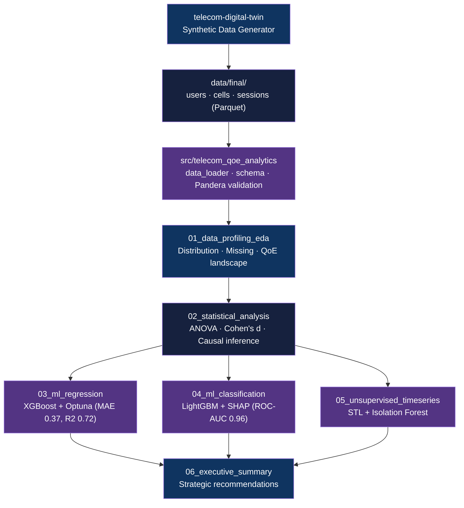

<div align="center">

# Telecom QoE Analytics

[](https://www.python.org/downloads/)
[](https://github.com/astral-sh/uv)
[](https://xgboost.readthedocs.io/)
[](LICENSE)

**Six-phase EDA-to-ML analytics pipeline for telecom Quality of Experience data**

[Getting Started](#getting-started) | [Usage](#usage) | [Methodology](#methodology)

</div>

---

## Table of Contents

- [Features](#features)
- [Tech Stack](#tech-stack)
- [The Problem](#the-problem)
- [Architecture](#architecture)
- [Getting Started](#getting-started)
  - [Prerequisites](#prerequisites)
  - [Installation](#installation)
- [Usage](#usage)
- [Methodology](#methodology)
- [Results](#results)
- [Data Engineering](#data-engineering)
- [Architectural Decisions](#architectural-decisions)
- [Project Structure](#project-structure)
- [Related Projects](#related-projects)
- [License](#license)
- [Author](#author)

## The Problem

### QoE Degradation in Telecom Networks

Telecom operators collect dense session-level telemetry (throughput, latency, jitter, packet loss) but lack a systematic path from raw data to ranked, actionable interventions. Without structured analytics, root causes stay buried and SLA risks go undetected until customers churn.

### The Solution

This project applies a six-phase data science pipeline to synthetic telecom session data, moving from EDA and statistical testing through gradient-boosted ML models and unsupervised anomaly detection to produce prioritized network improvement recommendations backed by SHAP attribution and effect-size evidence.

## Features

- **Six-phase notebook pipeline** - Data profiling, statistical analysis, regression, classification, anomaly detection, and executive summary in sequential Jupyter notebooks
- **Schema-validated data loading** - Pandera-backed validation of `users`, `cells`, and `sessions` parquet tables via a shared `src/` module
- **SHAP interpretability** - Feature attribution using SHAP values across XGBoost and LightGBM models, not just gain metrics
- **Time-aware ML splits** - Temporal train/val/test splits (70/15/15) to avoid leakage in session-level data
- **Anomaly detection** - STL decomposition followed by Isolation Forest to surface unknown network events
- **Optuna hyperparameter tuning** - Automated search for regression and classification model configs

## Tech Stack

| Component | Technology |
|-----------|------------|
| Language | Python 3.10+ |
| Notebooks | Jupyter Lab |
| ML Models | XGBoost 3.x, LightGBM 4.x, scikit-learn |
| Explainability | SHAP |
| Hyperparameter Tuning | Optuna |
| Statistical Analysis | statsmodels, scipy |
| Data Validation | Pandera |
| Dependency Management | uv |
| Experiment Tracking | MLflow, Weights and Biases |

## Architecture



## Getting Started

### Prerequisites

- Python 3.10+
- [uv](https://github.com/astral-sh/uv) package manager
- Parquet dataset files generated by [telecom-digital-twin](https://github.com/adityonugrohoid/telecom-digital-twin) - place under `data/final/`

### Installation

1. Clone the repository:
   ```bash
   git clone https://github.com/adityonugrohoid/telecom-qoe-analytics.git
   cd telecom-qoe-analytics
   ```

2. Install dependencies with uv:
   ```bash
   uv sync
   ```

## Usage

Launch Jupyter Lab within the managed environment:

```bash
uv run jupyter lab
```

Run notebooks in order:

```
notebooks/01_data_profiling_eda.ipynb
notebooks/02_statistical_analysis.ipynb
notebooks/03_ml_regression.ipynb
notebooks/04_ml_classification.ipynb
notebooks/05_unsupervised_timeseries.ipynb
notebooks/06_executive_summary.ipynb
```

The shared data loader is also importable directly:

```python
from telecom_qoe_analytics.data_loader import get_merged_dataset, get_time_split

df = get_merged_dataset(include_users=True, include_cells=True)
train, val, test = get_time_split(df, time_col="timestamp_start")
```

## Methodology

### Problem Framing

| Attribute | Value |
|-----------|-------|
| Problem Type | Regression + Classification + Anomaly Detection |
| Target Variable | `qoe_score` (MOS-based, continuous) |
| Primary Metrics | MAE / RMSE / R2 (regression), ROC-AUC / Recall (classification) |
| Key Challenge | Class imbalance in Low QoE detection, temporal leakage prevention |

### Training Approach

| Phase | Algorithm | Validation |
|-------|-----------|------------|
| Regression (nb 03) | XGBoost Regressor, Optuna-tuned | Temporal 70/15/15 split |
| Classification (nb 04) | LightGBM Classifier, imbalance-handled | Temporal 70/15/15 split, SHAP |
| Anomaly Detection (nb 05) | STL Decomposition + Isolation Forest | Unsupervised; ~5% anomaly rate |

## Results

### Key Findings

| Model | Metric | Score | Notes |
|-------|--------|-------|-------|
| XGBoost Regression | MAE | 0.3672 | QoE score prediction |
| XGBoost Regression | RMSE | 0.4560 | - |
| XGBoost Regression | R2 | 0.7247 | Suitable for real-time QoE scoring |
| LightGBM Classification | ROC-AUC | 0.9645 | Low QoE event detection |
| LightGBM Classification | Recall (Low QoE) | 0.92 | Tuned to minimize false negatives |
| LightGBM Classification | Precision (Low QoE) | 0.46 | Acceptable given SLA cost asymmetry |
| Congestion effect size | Cohen's d | -2.12 | Largest driver of QoE degradation |

### Top Predictors

1. `latency_ms` - top regression feature; directly maps to perceived user speed
2. `congestion` (cell-level) - Cohen's d of -2.12 in ANOVA; primary anomaly cluster cause
3. Network band (L900/L1800/L2100/n78) - capacity and propagation differences drive tier splits

### Strategic Recommendations (from nb 06)

1. Prioritize backhaul expansion at high-congestion cells (effect size evidence)
2. Latency optimization before throughput scaling (feature importance ordering)
3. Deploy anomaly model for evening peak (5 PM cluster) early-warning alerts
4. Regression model (R2 0.72) viable for real-time QoE prediction in CEM dashboards

## Data Engineering

| Attribute | Value |
|-----------|-------|
| Data Source | Synthetic (telecom-digital-twin generator) |
| Tables | `users`, `cells`, `sessions` (Parquet) |
| Session Features | Throughput, latency, jitter, packet loss, QoE MOS |
| Cell Features | Tower location, band (L900/L1800/L2100/n78), capacity |
| User Features | Demographics, device type, plan (prepaid/postpaid) |
| Validation | Pandera schema at load time (`schemas/v1_0.json`) |

## Architectural Decisions

### 1. Gradient Boosting over Deep Learning

**Decision:** XGBoost and LightGBM instead of neural networks for all supervised tasks.

**Reasoning:** Telecom session data is tabular and heterogeneous with non-linear interaction terms (congestion x signal strength). Tree ensembles handle these natively and expose SHAP attributions that field engineers can act on directly. Neural networks offer no interpretability advantage on this data shape and require substantially more tuning.

### 2. SHAP over Gain-based Feature Importance

**Decision:** SHAP (SHapley Additive Explanations) as the primary attribution method.

**Reasoning:** Standard information-gain metrics are biased toward high-cardinality features. SHAP provides game-theoretic consistency guarantees, allowing a definitive ranking that placed `congestion` above `signal_strength` - directly driving the backhaul expansion recommendation.

### 3. Recall-optimized Threshold for Anomaly Classification

**Decision:** Model threshold tuned to maximize Recall (0.92) at the cost of Precision (0.46) for the Low QoE binary classifier.

**Reasoning:** In network operations, a false negative (missed outage) carries far higher cost than a false positive (unnecessary investigation). The asymmetry justifies accepting lower precision to ensure SLA compliance.

### 4. Temporal Split over K-Fold CV

**Decision:** Chronological 70/15/15 train/val/test split rather than random k-fold.

**Reasoning:** Session data has temporal structure; random splits allow future data to inform past predictions. A temporal split matches the real deployment scenario where the model scores sessions it has never seen chronologically.

## Project Structure

```
telecom-qoe-analytics/
├── notebooks/
│   ├── 01_data_profiling_eda.ipynb        # EDA, schema validation, QoE distribution
│   ├── 02_statistical_analysis.ipynb      # ANOVA, Cohen's d, causal inference
│   ├── 03_ml_regression.ipynb             # XGBoost + Optuna, MAE 0.37, R2 0.72
│   ├── 04_ml_classification.ipynb         # LightGBM + SHAP, ROC-AUC 0.96
│   ├── 05_unsupervised_timeseries.ipynb   # STL + Isolation Forest
│   └── 06_executive_summary.ipynb         # Strategic recommendations
│
├── src/telecom_qoe_analytics/
│   ├── data_loader.py                     # Data loading, merging, feature engineering
│   └── schema.py                          # Pandera schema definitions
│
├── data/final/                            # Parquet datasets (gitignored)
├── schemas/v1_0.json                      # JSON schema for dataset validation
├── output/                                # Saved figures and model artifacts
├── pyproject.toml                         # uv/hatch project config
└── uv.lock                                # Locked dependency tree
```

## Related Projects

| Project | Description |
|---------|-------------|
| [telecom-digital-twin](https://github.com/adityonugrohoid/telecom-digital-twin) | Deterministic synthetic LTE dataset generator with physics-based network KPIs |

## License

This project is licensed under the [MIT License](LICENSE).

## Author

**Adityo Nugroho** ([@adityonugrohoid](https://github.com/adityonugrohoid))
